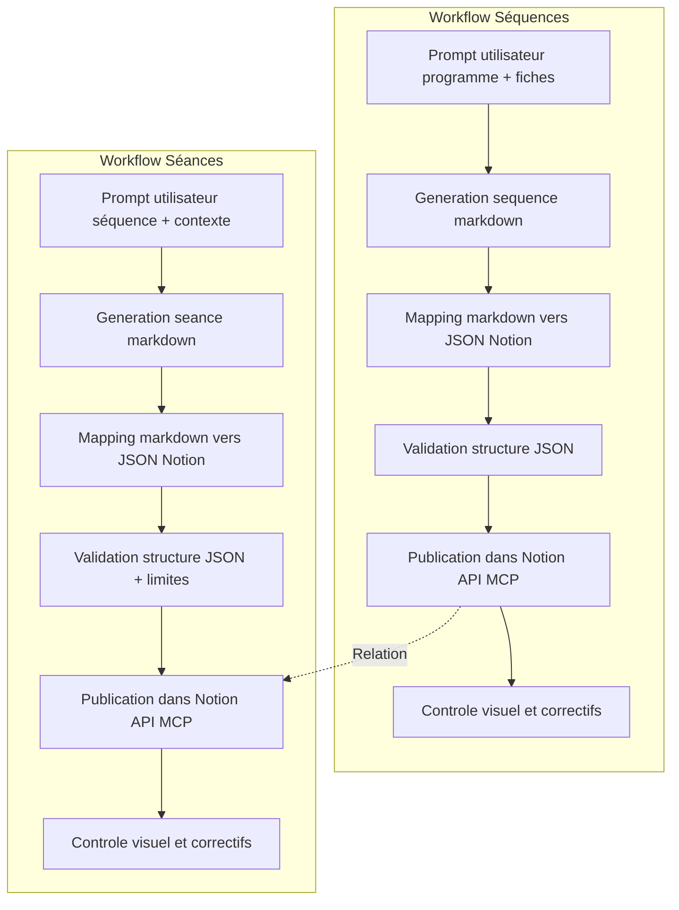
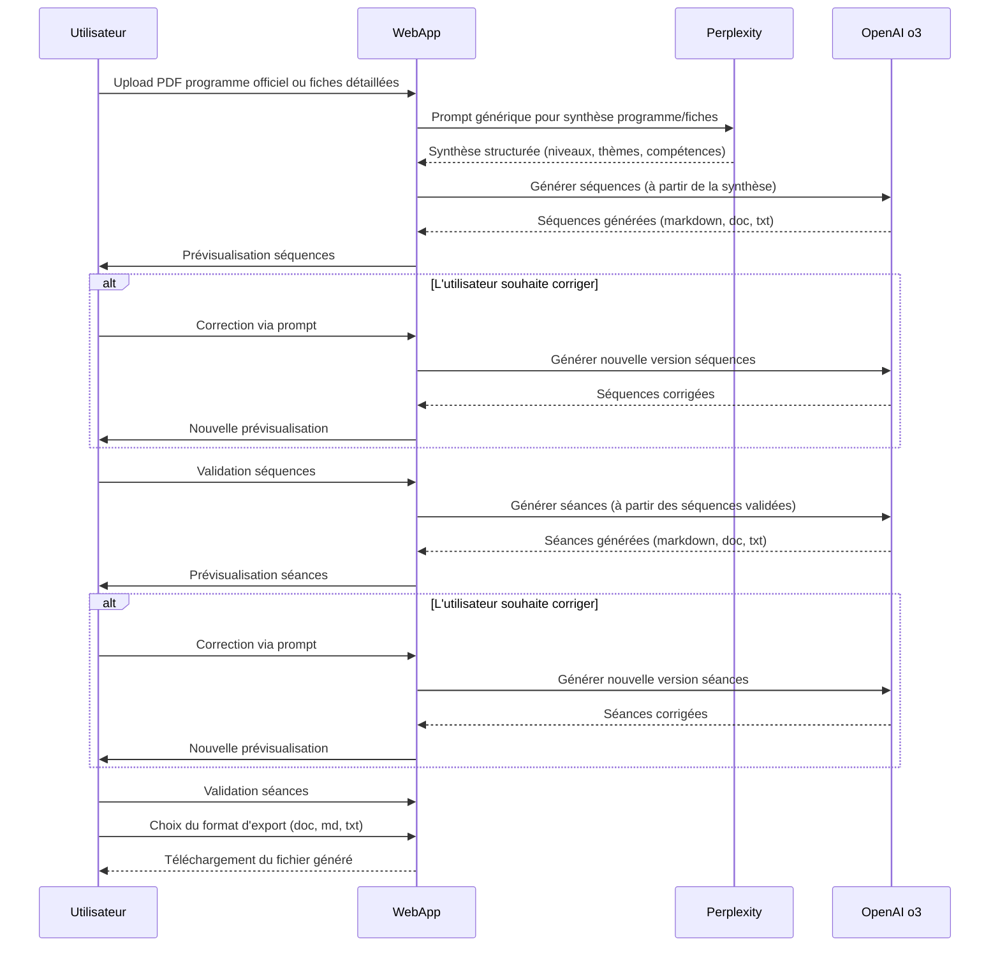

# 📚 Workflow complet : Génération et Publication de Séquences et Séances Pédagogiques dans Notion

---

## 📋 Table des matières

1. [Workflow Séquences Pédagogiques](#workflow-séquences-pédagogiques)
2. [Workflow Séances Pédagogiques](#workflow-séances-pédagogiques)
3. [Propriétés des bases Notion](#propriétés-des-bases-notion)
4. [Mapping détaillé](#mapping-détaillé)
5. [Validation et publication](#validation-et-publication)
6. [Bonnes pratiques](#bonnes-pratiques)
7. [Exemples et ressources](#exemples-et-ressources)

---

## 🔄 Workflow Séquences Pédagogiques

### 1. **Génération de la séquence pédagogique (prompt_sequence.md)**

#### **Point de départ**

- Utiliser le prompt `assets/prompts/prompt_sequence.md` pour cadrer la génération.
- Exiger de l'utilisateur :
  - Le tableau du programme officiel (niveau, thème, compétences, attendus…)
  - Les fiches thématiques détaillées (notions, activités, ressources, évaluations)
  - Les contraintes spécifiques éventuelles

#### **Étapes de génération**

1. **Analyser le programme** pour identifier : niveau, thème, attendus, compétences.
2. **Étudier les fiches** pour extraire : notions, activités, ressources, évaluations.
3. **Structurer la séquence** : séances logiques, objectifs, activités, supports, évaluations, AP si possible.
4. **Inclure** : différenciation, projet final, justification pédagogique, ressources complémentaires.
5. **Format attendu** : markdown conforme au template fourni (`sequence-template.md`).

### 2. **Conversion du markdown vers le format Notion JSON**

#### **Mapping**

- Utiliser le template `assets/templates/sequence-template.notion.json` comme référence de structure.
- Respecter :
  - Les types de blocks Notion (`heading_1`, `paragraph`, `bulleted_list_item`, `divider`, `table`, etc.)
  - Les propriétés de la base Notion (titre, classe, thème, durée, problématique, matière, numéro…)
  - Le mapping du tableau markdown → bloc `table` Notion (voir ci-dessous).

#### **Exigences pour le bloc `table`**

- La clé `children` doit être **imbriquée dans la propriété `table`**.
- Chaque ligne (`table_row`) doit avoir **exactement le même nombre de cellules** que `table_width`.
- Les cellules vides doivent être présentes (exemple : `[{ "type": "text", "text": { "content": "" }, ... }]`).
- **Aucune clé `has_children`** dans le payload.

#### **Exemple de structure JSON Notion**

```json
{
  "object": "block",
  "type": "table",
  "table": {
    "table_width": 7,
    "has_column_header": true,
    "has_row_header": false,
    "children": [
      {
        "object": "block",
        "type": "table_row",
        "table_row": {
          "cells": [
            [{ "type": "text", "text": { "content": "Titre de la séance" }, ... }],
            [{ "type": "text", "text": { "content": "Problématique / Question" }, ... }],
            // ... 5 autres cellules
          ]
        }
      },
      // ... autres lignes, toutes avec 7 cellules
    ]
  }
}
```

---

## 🎯 Workflow Séances Pédagogiques

### 1. **Génération de la séance pédagogique (prompt_seances.md)**

#### **Point de départ**

- Utiliser le prompt `assets/prompts/prompt_seances.md` pour cadrer la génération.
- Exiger de l'utilisateur :
  - La séquence parente et son contexte
  - Les objectifs spécifiques de la séance
  - Les contraintes temporelles et matérielles
  - Le niveau et profil des élèves

#### **Étapes de génération**

1. **Analyser la séquence parente** pour identifier le contexte et les prérequis.
2. **Définir les objectifs** spécifiques de la séance (connaissances, compétences, attitudes).
3. **Structurer la séance** : déroulé pédagogique, activités, supports, évaluation.
4. **Inclure** : différenciation, trace écrite, ressources, modalités d'évaluation.
5. **Format attendu** : markdown conforme au template fourni (`seance-template.md`).

### 2. **Conversion du markdown vers le format Notion JSON**

#### **Mapping**

- Utiliser le template `assets/templates/seance-template.notion.json` comme référence de structure.
- Respecter :
  - Les types de blocks Notion (`heading_1`, `heading_2`, `heading_3`, `paragraph`, `bulleted_list_item`, `table`, etc.)
  - Les propriétés de la base Notion (titre, durée, séquence liée, classe, matière)
  - Le mapping des sections détaillées avec blocs imbriqués (voir ci-dessous).

#### **Exigences pour les blocs imbriqués (children)**

- Les sections détaillées (ex: "Activités élèves détaillées", "Références et ressources") doivent utiliser des blocs `heading_3` avec la propriété `children`.
- Chaque bloc enfant doit respecter la limite de 2000 caractères par bloc.
- **Exemple de structure avec enfants imbriqués :**

```json
{
  "object": "block",
  "type": "heading_3",
  "heading_3": {
    "rich_text": [
      { "type": "text", "text": { "content": "Analyse de la DDHC" } }
    ],
    "children": [
      {
        "object": "block",
        "type": "bulleted_list_item",
        "bulleted_list_item": {
          "rich_text": [
            { "type": "text", "text": { "content": "Objectif : ..." } }
          ]
        }
      }
    ]
  }
}
```

#### **Gestion des limites de caractères**

- **Limite Notion** : 2000 caractères maximum par bloc.
- **Solution** : Découper automatiquement les longs contenus en plusieurs blocs `paragraph`.
- **Préférence** : Découper aux sous-titres (`heading_3`) quand possible.
- **Exemple de découpage :**

```json
// Au lieu d'un seul bloc de 3000 caractères
{
  "object": "block",
  "type": "paragraph",
  "paragraph": {
    "rich_text": [{ "type": "text", "text": { "content": "Contenu très long..." } }]
  }
}

// Utiliser plusieurs blocs
[
  {
    "object": "block",
    "type": "paragraph",
    "paragraph": {
      "rich_text": [{ "type": "text", "text": { "content": "Première partie..." } }]
    }
  },
  {
    "object": "block",
    "type": "paragraph",
    "paragraph": {
      "rich_text": [{ "type": "text", "text": { "content": "Deuxième partie..." } }]
    }
  }
]
```

---

## 📑 Propriétés des bases Notion

### Base « Séquences Pédagogiques » (ID : 1f2b90577c8180f5b3a2e774c376be6a)

| Nom de la propriété  | Type         | Description                                                                |
| -------------------- | ------------ | -------------------------------------------------------------------------- |
| Titre de la séquence | title        | Titre principal de la séquence (obligatoire)                               |
| Durée                | rich_text    | Durée indicative de la séquence                                            |
| Numéro               | number       | Numéro d'ordre de la séquence                                              |
| Problématique        | rich_text    | Problématique ou question centrale de la séquence                          |
| Matière              | multi_select | Matière(s) concernée(s) (ex : Géo, Histoire, Lettres, Metacognition, etc.) |
| Séances liées        | relation     | Lien vers les séances associées (relation avec une autre base Notion)      |
| Classe               | multi_select | Niveau(x) concerné(s) (ex : CAP, Seconde Pro, Première Pro, Terminale Pro) |
| Thème                | rich_text    | Thème ou axe principal de la séquence                                      |
| Ordre classe         | formula      | Calcul automatique pour trier les séquences par niveau                     |

### Base « Séances » (ID : 1f2b90577c8180299537d3067cb51d00)

| Nom de la propriété | Type         | Description                                                                |
| ------------------- | ------------ | -------------------------------------------------------------------------- |
| Titre de la séance  | title        | Titre principal de la séance (obligatoire)                                 |
| Durée               | rich_text    | Durée de la séance (ex : "1h30", "2h")                                     |
| Séquence liée       | relation     | Lien vers la séquence parente (relation avec la base Séquences)            |
| Classe              | multi_select | Niveau(x) concerné(s) (ex : CAP, Seconde Pro, Première Pro, Terminale Pro) |
| Matière             | multi_select | Matière(s) concernée(s) (ex : Géo, Histoire, Lettres, Metacognition, etc.) |

> **Remarque** : Toute propriété doit être renseignée selon son type. Les propriétés multi_select acceptent plusieurs valeurs. Les relations doivent utiliser l'ID exact de la base cible.

---

## 🗂️ Mapping détaillé des propriétés Notion

### Base « Séquences Pédagogiques » (ID : 1f2b90577c8180f5b3a2e774c376be6a)

| Propriété            | Type         | Valeurs possibles / Détail                                                     |
| -------------------- | ------------ | ------------------------------------------------------------------------------ |
| Titre de la séquence | title        | Texte libre                                                                    |
| Durée                | rich_text    | Texte libre                                                                    |
| Numéro               | number       | Nombre                                                                         |
| Problématique        | rich_text    | Texte libre                                                                    |
| Matière              | multi_select | Lettres (orange), Géo (green), Histoire (red), Metacognition (blue)            |
| Séances liées        | relation     | Relation vers la base « Séances » (ID : 1f2b90577c8180299537d3067cb51d00)      |
| Classe               | multi_select | CAP (brown), Seconde Pro (yellow), Première Pro (pink), Terminale Pro (purple) |
| Thème                | rich_text    | Texte libre                                                                    |
| Ordre classe         | formula      | Calcul automatique (voir base Notion)                                          |

### Base « Séances » (ID : 1f2b90577c8180299537d3067cb51d00)

| Propriété          | Type         | Valeurs possibles / Détail                                                               |
| ------------------ | ------------ | ---------------------------------------------------------------------------------------- |
| Titre de la séance | title        | Texte libre                                                                              |
| Durée              | rich_text    | Texte libre                                                                              |
| Séquence liée      | relation     | Relation vers la base « Séquences Pédagogiques » (ID : 1f2b90577c8180f5b3a2e774c376be6a) |
| Classe             | multi_select | CAP (brown), Seconde Pro (yellow), Première Pro (pink), Terminale Pro (purple)           |
| Matière            | multi_select | Lettres (orange), Géo (green), Histoire (red), Metacognition (blue)                      |

**Détail des valeurs multi-select :**

- **Matière** : Lettres (orange), Géo (green), Histoire (red), Metacognition (blue), Géographie (gray)
- **Classe** : CAP (brown), Seconde Pro (yellow), Première Pro (pink), Terminale Pro (purple)

> **Remarque :** Pour chaque propriété multi_select, la valeur doit correspondre exactement à l'un des noms listés ci-dessus (respecter la casse et l'orthographe). Pour les relations, utiliser l'ID de la base cible indiqué.

---

## 3. **Validation et correction du JSON**

### **Étapes de validation**

- **Vérifier la présence de la clé `children`** dans chaque bloc `table` et `heading_3`.
- **Vérifier le nombre de cellules** dans chaque ligne du tableau.
- **Vérifier la limite de 2000 caractères** par bloc de contenu.
- **Corriger les erreurs** signalées par l'API Notion.
- **Supprimer tout commentaire JSON** (non supporté).

---

## 4. **Publication dans Notion**

### **Création de la page**

- Utiliser l'API Notion (via MCP ou SDK officiel).
- Pour créer une **entrée dans une base de données Notion** :
  - Utiliser l'ID de la base (`database_id`), pas d'une page parent.
  - Exemple de payload :
    ```json
    {
      "parent": { "database_id": "..." },
      "properties": { ... },
      "children": [ ... ]
    }
    ```
- **Partager la base avec l'intégration** (dans Notion, bouton "Partager" > ajouter l'intégration/bot).

### **Gestion des erreurs**

- **Erreur 400** : souvent causée par un mauvais mapping du bloc `table` ou des blocs imbriqués.
- **Erreur 404** : l'ID de la base n'est pas accessible ou n'existe pas, ou l'intégration n'a pas les droits.
- **Erreur de validation** : vérifier les limites de caractères et la structure des blocs.

### 🧪 Icône et cover par défaut pour les pages Séquences Pédagogiques

Pour toute nouvelle page créée dans la base « Séquences Pédagogiques » (ID : 1f2b90577c8180f5b3a2e774c376be6a), il est **obligatoire** d'ajouter :

- **Icône** : emoji `🧪`
- **Cover** : image couleur unie (exemple : https://singlecolorimage.com/get/4F8A8B/1200x300)

**Processus de création :**

1. **POST initial** : Créer la page sans l'icône et la cover.

```json
{
  "parent": { "database_id": "1f2b90577c8180f5b3a2e774c376be6a" },
  "properties": { ... },
  "children": [ ... ]
}
```

2. **PATCH** : Ajouter l'icône et la cover à la page créée.

```json
{
  "icon": { "emoji": "🧪" },
  "cover": {
    "external": { "url": "https://singlecolorimage.com/get/4F8A8B/1200x300" }
  }
}
```

> **Ne jamais omettre ces champs lors de la création d'une page Séquence.**

---

## 5. **Bonnes pratiques et points de vigilance**

### ⚠️ Avertissement : POST Notion sans children

**Ne jamais envoyer un POST de création de page Notion sans le champ `children` correctement renseigné.**

- Si le payload POST ne contient pas les blocs de contenu (`children`), la page sera créée vide (hors propriétés) et il faudra PATCH pour ajouter le contenu, ce qui fait perdre du temps et complexifie le workflow.
- Toujours générer et valider le mapping markdown → Notion blocks avant le POST.

### **Bonnes pratiques générales**

- **Toujours valider la structure du JSON** avant envoi.
- **Respecter strictement les templates Notion** (voir `sequence-template.notion.json` et `seance-template.notion.json`).
- **Documenter toute correction ou adaptation** dans le process.
- **Utiliser Sequential Thinking et Serena** pour analyser, corriger, et tracer les étapes du workflow.
- **Mettre à jour la documentation** à chaque évolution du template ou du process.

### **Bonnes pratiques spécifiques aux séances**

- **Gérer les blocs imbriqués** : Utiliser la propriété `children` pour les sections détaillées.
- **Respecter les limites de caractères** : Découper automatiquement les longs contenus.
- **Lier correctement les séances** : Utiliser l'ID exact de la séquence parente.
- **Structurer le contenu** : Organiser avec des `heading_2` et `heading_3` appropriés.

---

## 6. **Exemples de fichiers**

### **Séquences**

- **Markdown source** : `geo/3-Terminale/sequence1-acces-ressources.md`
- **JSON Notion généré** : `geo/3-Terminale/sequence1-acces-ressources.notion.json`
- **Template Notion** : `assets/templates/sequence-template.notion.json`
- **Prompt de génération** : `assets/prompts/prompt_sequence.md`

### **Séances**

- **Markdown source** : `histoire/0-CAP/sequence1/seances/Seance1_Revolution_1789.md`
- **Template Notion** : `assets/templates/seance-template.notion.json`
- **Prompt de génération** : `assets/prompts/prompt_seances.md`

---

## 7. **Résumé du process (schéma)**



---

## 8. **Ressources utiles**

- [Documentation Notion API](https://developers.notion.com/reference/post-page)
- [Template Notion JSON Séquences](../assets/templates/sequence-template.notion.json)
- [Template Notion JSON Séances](../assets/templates/seance-template.notion.json)
- [Template markdown de séquence](../assets/templates/sequence-template.md)
- [Template markdown de séance](../assets/templates/seance-template.md)
- [Prompt de génération séquence](../assets/prompts/prompt_sequence.md)
- [Prompt de génération séance](../assets/prompts/prompt_seances.md)
- [README du projet](../README.md)

---

**Ce workflow garantit la conformité, la traçabilité et la robustesse de la génération et publication de séquences et séances pédagogiques dans Notion.**
_Mise à jour à chaque évolution du template ou du process recommandée._

---

## 9. Évolution future : vers une webapp complète

### Objectif

Permettre à tout utilisateur de générer, corriger et exporter des séquences et séances pédagogiques à partir de programmes officiels (PDF) ou de fiches détaillées, via une interface web simple et accessible.

### Fonctionnalités clés envisagées

- **Import de documents** : Upload de PDF de programme officiel ou de fiches détaillées.
- **Synthèse automatique** : Utilisation de Perplexity pour générer une synthèse structurée (niveaux, thèmes, compétences) à partir des documents importés.
- **Génération assistée** : Génération automatique des séquences et séances pédagogiques à partir de la synthèse, via OpenAI o3.
- **Prévisualisation et correction** : Interface utilisateur permettant de prévisualiser, corriger ou enrichir les séquences/séances générées à l’aide de prompts personnalisés.
- **Validation utilisateur** : L’utilisateur valide chaque séquence ou séance avant export.
- **Export local multi-format** : Téléchargement des séquences et séances validées au format de son choix (doc, md, txt).
- **Historique et suivi** : Tableau de bord pour suivre l’avancement, l’historique des générations, et gérer les corrections.

### Architecture cible (extrait du diagramme de séquence)



### Perspectives

- **Accessibilité** : Application utilisable sans connaissance technique, ouverte à tous les enseignants.
- **Extensibilité** : Possibilité d’ajouter d’autres formats d’import/export, de nouveaux modèles d’IA, ou des modules collaboratifs.
- **Sécurité & confidentialité** : Traitement local ou cloud sécurisé, respect des données utilisateurs.
- **Interopérabilité** : Intégration future possible avec d’autres plateformes (ENT, LMS, etc.).

> Cette évolution vise à démocratiser la génération de séquences et séances pédagogiques assistée par IA, tout en garantissant contrôle, personnalisation et simplicité d’usage.
